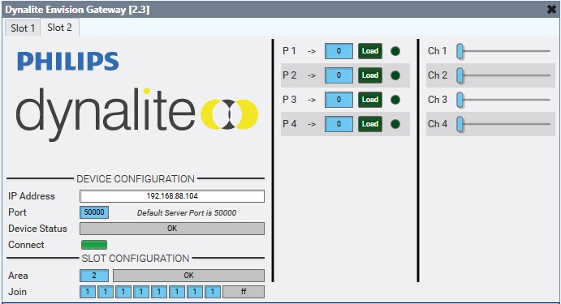

# Dynalite Envision Gateway

This is a Q-SYS Plugin for Dynalite Envision Gateways. This Plugin can use either ***DyNet 1*** or the ***DyNet Text Protocol***.

> Bug reports and feature requests should be sent to Jason Foord (jf@tag.com.au).

## How do I get set up?

See [Q-SYS Online Help File - Plugins](https://q-syshelp.qsc.com/#Schematic_Library/plugins.htm)

## Properties

#### DyNet Protocol

The protocol to use.

> DyNet 1 | DyNet Text

> The Protocol of the Envision Gateway is set under the *Port Editor* tab in *Dynalite System Builder*

#### Enable Polling

Whether the plugin will poll current presets and levels.

> Polling is not necessary when using DyNet Text Protocol - it is event driven.

#### Poll Rate (s)

The polling interval.

> Polling is not necessary when using DyNet Text Protocol - it is event driven.

#### Connection Type

The connection method.

> TCP | Serial

#### Area Slots

Each area slot will generate a new page.

> Each page configures a single area, or can be left on area '0' (none).

#### Presets

The number of preset slots available in each area slot.

#### Enable Logical Channels

Whether to show logical channel controls.

#### Logical Channels

The number of logical channel controls to show in each area slot.

> For DyNet Text, the value range is ***0 - 100%***

> For DyNet 1, the value range is ***255 - 0***

## Controls

### Area Slot

#### IP Address

The IP Address of the device.

> This is a global control that displays on every page.

#### Port

The TCP port to use.

> This is a global control that displays on every page.

> DyNet Text = 23

> DyNet 1 = 49152-65535 | 50000

#### Device Status

Displays the device's status.

> This is a global control that displays on every page.

#### Connect

Toggles the connection to the device.

> This is a global control that displays on every page.

##### Area Number

The Area to control. Leave at '0' if unallocated.

0 | 255

> DyNet 1 only supports areas up to 255. If you are working with DyNet 2 areas greater than 255, you can perform address translations on the DyNet 2 gateway.

> Area information is configured in the *Dynalite System Builder* software.

##### Area Status

The plugin-determined status of the area.

> :warning: ***Avoid having the same area number in multiple slots; it won't break everything, but the feedback hasn't been fully optimised for this use case as it shouldn't exist.***

> Area Unallocated | Area is Duplicate | OK

##### Preset Fade Time

The fade time to recall the preset with when loaded.

##### Preset Load

Recalls the preset.

##### Preset Match

Indicates if the preset is currently active.

> Adjusting a logical channel level manually will clear all preset match indicators.

##### Area Logical Channel Level

Control of the logical channel level.

> Can either be used in real-time, or snapshotted in Q-SYS to achieve 'preset' functionality.